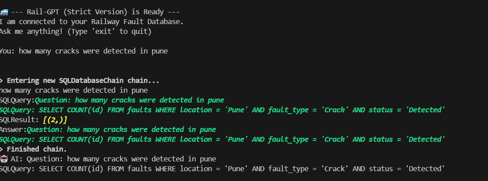

# 🚄 Rail-GPT: GenAI Agent for Railway Fault Detection


**Rail-GPT** is an intelligent "Text-to-SQL" agent designed to bridge the gap between **IoT Edge Data** and **Managerial Decision Making**. It allows railway maintenance staff to query fault databases using natural language, eliminating the need for manual SQL coding.



## 🏗 Architecture
This project implements a **Hybrid Edge-Cloud Architecture**:
1.  **Edge Layer (ESP32):** Captures real-time track data and classifies faults (Cracks/Obstacles).
2.  **Data Layer (SQLite):** Stores structured fault logs locally.
3.  **Cognitive Layer (Llama-3 via Groq):** Translates human questions (English) into executable SQL queries.

## 🚀 Key Features
* **Zero-Hallucination SQL:** Uses strict prompt engineering to ensure only valid SQL is generated.
* **Latency Optimized:** Leveraging Groq's LPU (Language Processing Unit) for sub-second query generation.
* **Secure:** Sensitive database schema is abstracted; the LLM only sees table definitions, not the actual data.

## 🛠 Installation
1.  **Clone the repo:**
    ```bash
    git clone [https://github.com/hemanthmuralik/Rail-GPT.git](https://github.com/hemanthmuralik/Rail-GPT.git)
    cd Rail-GPT
    ```
2.  **Install dependencies:**
    ```bash
    pip install -r requirements.txt
    ```
3.  **Setup API Key:**
    * Create a `.env` file and add your Groq Key:
    ```bash
    GROQ_API_KEY=gsk_...
    ```
4.  **Run the Agent:**
    ```bash
    python agent.py
    ```

## 🔮 Future Scope
* Integration with **WhatsApp API** for mobile alerts.
* Adding **Vector Search (RAG)** to query PDF maintenance manuals.
