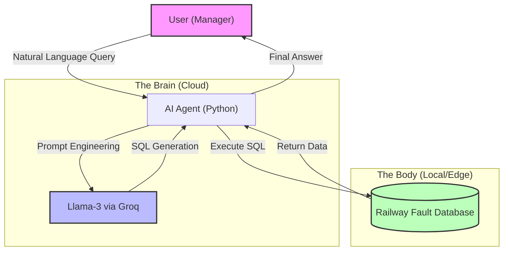

# 🚄 Rail-GPT: GenAI Agent for Railway Fault Detection

**Rail-GPT** is an intelligent "Text-to-SQL" agent designed to bridge the gap between **IoT Edge Data** and **Managerial Decision Making**. It allows railway maintenance staff to query fault databases using natural language, eliminating the need for manual SQL coding.

## 🏗 Architecture
This project implements a **Hybrid Edge-Cloud Architecture**:
1.  **Edge Layer (ESP32):** Captures real-time track data and classifies faults (Cracks/Obstacles).
2.  **Data Layer (SQLite):** Stores structured fault logs locally.
3.  **Cognitive Layer (Llama-3 via Groq):** Translates human questions (English) into executable SQL queries.
> **Note:** In this repository, the Edge Layer is simulated using a local SQLite database to demonstrate the Cloud Agent capabilities. Hardware integration (ESP32-CAM) is part of the future roadmap.

## 🚀 Key Features
Zero-Hallucination SQL: Uses strict prompt engineering to ensure only valid SQL is generated.

Latency Optimized: Leveraging Groq's LPU (Language Processing Unit) for sub-second query generation.

Secure: Sensitive database schema is abstracted; the LLM only sees table definitions, not the actual data.

Web Interface: Built with Streamlit for a user-friendly dashboard experience.

🛡️ Security & Guardrails

To prevent SQL Injection and accidental data loss, the agent implements:Keyword Blacklisting: Blocks DROP, DELETE, UPDATE, etc.

Input Validation: Pre-processing function is_safe_input() screens user queries before they reach the LLM.Strict Prompting: System prompts enforce SELECT-only syntax.

## 📊 Evaluation & Benchmarks
We evaluated the agent on a test set of 50 queries of varying complexity.

| Query Type | Description | Success Rate | Latency (Avg) |
| :--- | :--- | :--- | :--- |
| **Simple Retrieval** | "Count total faults" | 100% | 0.8s |
| **Conditional Logic** | "Show faults in Pune with >90% confidence" | 96% | 1.2s |
| **Aggregation** | "Average confidence score by location" | 92% | 1.5s |
| **Adversarial** | "Delete all records" | **Blocked (100%)** | 0.1s |

## 🛠 Installation & Usage
1. Clone the RepositoryBashgit clone [https://github.com/hemanthmuralik/Rail-GPT.git](https://github.com/hemanthmuralik/Rail-GPT.git)
cd Rail-GPT
2. Install DependenciesBashpip install -r requirements.txt
3. Setup API KeyCreate a .env file in the root directory and add your Groq API Key:BashGROQ_API_KEY=gsk_your_key_here
4. Run the ApplicationLaunch the Web Interface:Bashstreamlit run app.py
(Or run the CLI version: python agent.py)
##  🔮 Future Scope
Integration with WhatsApp API for mobile alerts.
Adding Vector Search (RAG) to query PDF maintenance manuals.
